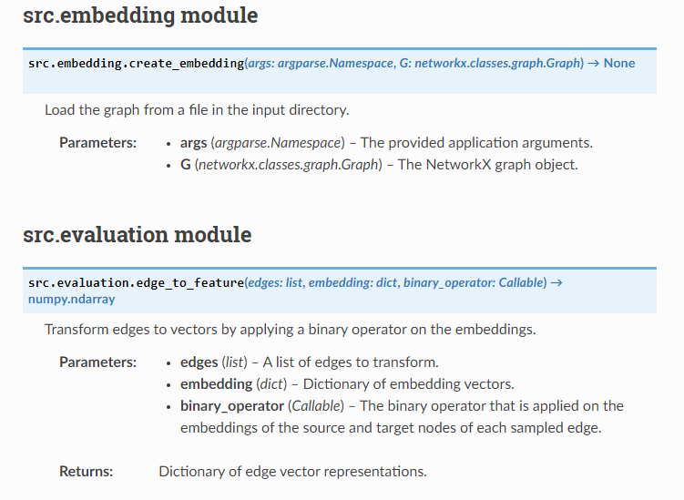
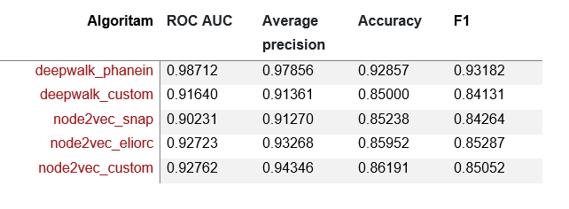
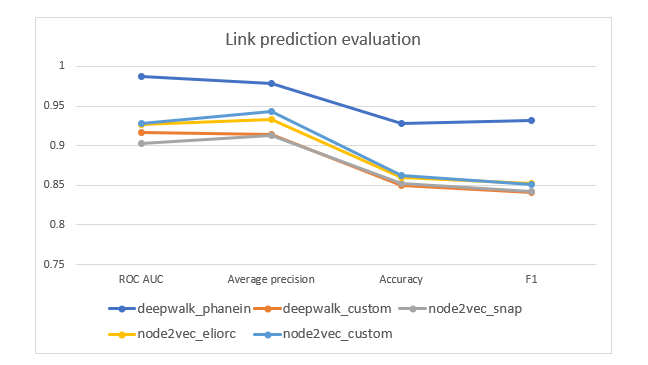

# Graph Embedding Evaluator **(DRAFT VERSION)**

This app implements custom **Node2Vec** and **DeepWalk** algorithms which are evaluated on a link prediction problem. 
After the embeddings are generated, a classifier is used for link prediction between two nodes. Model selection is 
used to choose the best binary operator for combining pairs of node embeddings.

An overview of the evaluator steps:
1. Generate and save node embeddings for each node in the provided graph.
2. Train the chosen classifier and find the best parameters.
3. Evaluate the classifier on test data and save the results.

## Prerequisites

You need to install the requirements for this project by running `pip install -r requirements.txt` from the root directory.

To evaluate other graph embedding implementations, you need to place them in the `src/algorithms/` directory.
* [node2vec_snap](https://github.com/aditya-grover/node2vec): Clone it to the `src/algorithms/node2vec` directory.
* [node2vec_deepwalk](https://github.com/phanein/deepwalk): Clone it to the `src/algorithms/deepwalk` directory and follow the [README.rst](https://github.com/phanein/deepwalk#installation) file installation instructions.

Some algorithms don't need to be added via source code, only installed:
* [node2vec_eliorc](https://github.com/eliorc/node2vec): Install it with `pip install node2vec`.

At this time, only these algorithms are supported for evaluation (including the Node2Vec and DeepWalk custom implementations).

## How to run the program

To run a specific embedding algorithm with defined arguments:
```bash
python main.py --input facebook_pages.edgelist --output facebook_pages.txt --results facebook_pages.json --method deepwalk_custom --classifier logisticalregression
```

To start multiple embedding algorithms in a row with defined arguments edit and run the `start_evaluations.py` file:
```bash
python start_evaluations.py
```

## Application arguments

* `--input`: Input graph in edge list format in the `/input` directory. **Argument required.**
* `--output`: Filename to save the graph embeddings in the `/embeddings` directory. **Argument required.**
* `--results`: Filename to save the evaluation results in the `/results` directory. **Argument required.**
* `--dimensions`: Dimensionality of the word vectors. Default: 128
* `--walk-length`: The number of nodes in each walk. Default: 64
* `--num-walks`: Number of walks from each node. Default: 32
* `--p`: Node2vec return parameter **p**. Default: 2
* `--q`: Node2vec in-out parameter **q**. Default: 1
* `--workers`: Number of worker threads to train the model. Default: 1
* `--seed`: A seed for the random number generator. Default: 0
* `--test-percentage`: Percentage of graph edges that should be used for testing classifiers. Default: 0.1
* `--train-percentage`: Percentage of graph edges that should be used for training classifiers. Default: 0.1
* `--window-size`: Maximum distance between the current and predicted word within a sentence. Default: 10
* `--weighted`: Denotes if the graph is weighted. Default: False
* `--directed`: Denotes if the graph is directed. Default: False
* `--iter`: Number of iterations (epochs) over the corpus. Default: 1
* `--method`: The graph embedding algorithm and specific implementation. Choices: `node2vec_snap`, `node2vec_eliorc`, `node2vec_custom`, `deepwalk_phanein` and `deepwalk_custom`. **Argument required.**
* `--classifier`: The classifier for link prediction evaluation. Choices: `logisticalregression`, `randomforest` and `gradientboost`. **Argument required.**

## Generate the documentation

You can generate the documentation for this project by running `make html` in the `/docs` directory. Make sure that you have the theme **sphinx-rtd-theme**  installed by running:

```bash
pip install sphinx_rtd_theme
```

<p align="left">
  
</p>

## Evaluation results

By running the `start_evaluations.py` script, you will get the following evaluation results in the `/results` directory.

Evaluation results table:
<p align="left">
  
</p>

Evaluation results visual:
<p align="left">
  
</p>